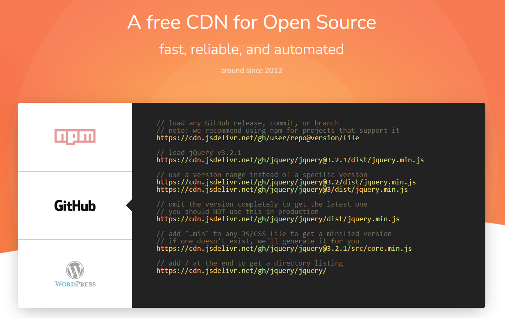

> **免费 CDN：`jsDelivr` + `Github`**

> `CDN`（`Content Delivery Network`，内容分发网络）是构建在现有网络基础之上的智能虚拟网络，依靠部署在各地的边缘服务器，通过中心平台的负载均衡、内容分发、调度等功能模块，使用户就近获取所需内容，降低网络拥塞，提高用户访问响应速度和命中率。CDN的关键技术主要有内容存储和分发技术。
>
> —— 摘自 《百度百科》

放在 `Github` 的资源在国内加载速度比较慢，因此需要使用 `CDN` 加速来优化网站打开速度，[jsDelivr](https://www.jsdelivr.com/) + [Github](https://github.com/) 便是免费且好用的 `CDN`，非常适合博客网站使用。

接下来将带着大家一起去搭建一个属于自己的 CDN~

## 一、新建Git仓库

在 `Github` 新建一个名为 `CDN` 的仓库，如下所示：


> 提示：仓库名其实可以随意取，这里我用 CDN 命名便于管理维护；

## 二、克隆仓库到本地

点击 `Code`， 一键复制仓库地址：


在本地目录右键 `Git Bash Here`，执行以下命令：

```shell
$ git clone 一键复制的仓库地址
```

## 三、上传资源

将需要上传的资源放到本地 `git` 仓库（注：`jsDelivr` 不支持加载超过 `20M` 的资源），在本地 `git` 仓库目录下右键 `Git Bash Here`，执行以下命令：

```shell
$ git status             
$ git add .              
$ git commit -m '提交信息' 
$ git push            
```

## 四、发布仓库（可忽略）

点击 `release` 发布：


填写发布信息：


> 提示：实际上你不需要发布，只要提交到仓库也可以访问。

## 五、通过 `jsDelivr` 引用资源




访问语法：

```
https://cdn.jsdelivr.net/gh/用户名/仓库名[@发布的版本号][@分支名]/文件路径
```

例如：

```
https://cdn.jsdelivr.net/gh/lihongyao/cdn/images/logo.png
https://cdn.jsdelivr.net/gh/lihongyao/cdn@master/images/logo.png
https://cdn.jsdelivr.net/gh/lihongyao/cdn@1.0.0/js/request.js
```

> 提示：`版本号` 和 `分支名` 非必须。


